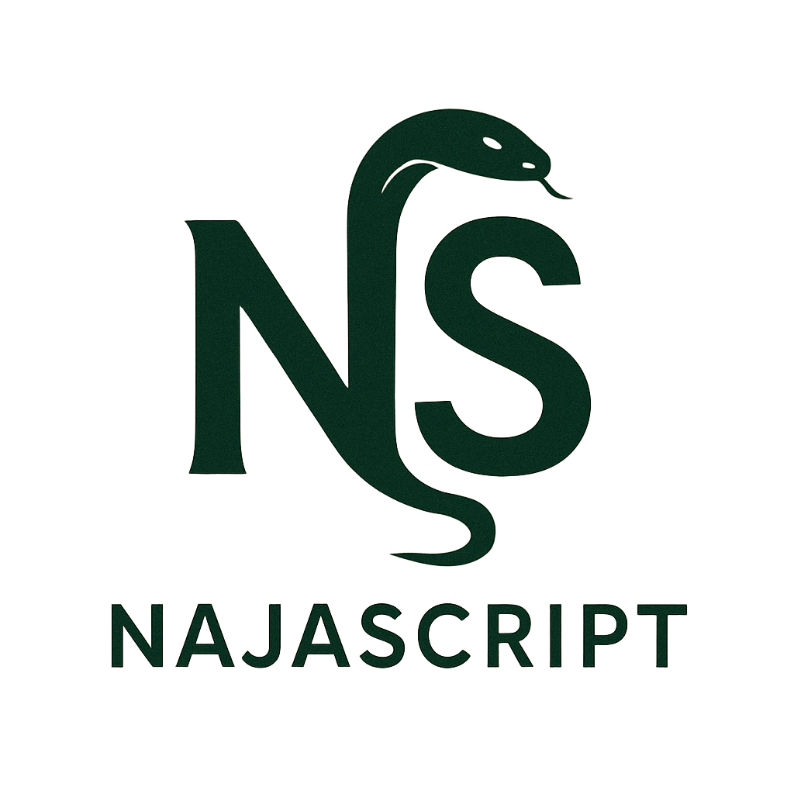

# NajaScript

NajaScript is an educational programming language designed to be accessible and easy to learn.



## Installation

### Windows

1. Download the latest installer from the [releases page](https://github.com/najascript/najascript/releases)
2. Run the installer and follow the instructions
3. After installation, you can run NajaScript from the Start Menu or command line with `najascript`

### Linux

#### Debian/Ubuntu based distributions

1. Download the .deb package from the [releases page](https://github.com/najascript/najascript/releases)
2. Install with: `sudo dpkg -i najascript_1.0.0_all.deb`
3. Run NajaScript from the terminal with `najascript`

#### Other distributions

1. Download the tarball from the [releases page](https://github.com/najascript/najascript/releases)
2. Extract it with: `tar -xzf najascript-1.0.0.tar.gz`
3. Run NajaScript from the extracted directory with `./najascript`

## Building from source

### Requirements

- Python 3.7 or newer
- PyInstaller (for creating executables)
- llvmlite

### Windows build

1. Install Inno Setup from [jrsoftware.org](https://jrsoftware.org/isdl.php)
2. Run `python build_installers.py`

### Linux build

1. Install FPM: `sudo apt-get install ruby ruby-dev && sudo gem install fpm` (Debian/Ubuntu)
2. Run `python build_installers.py`

## Usage

```bash
# Run a NajaScript file
najascript your_script.naja

# Run with debug information
najascript --debug your_script.naja

# Enable Portuguese language features
najascript --pt your_script.naja

# Interactive mode
najascript
```

## License

MIT License - see LICENSE file for details.

